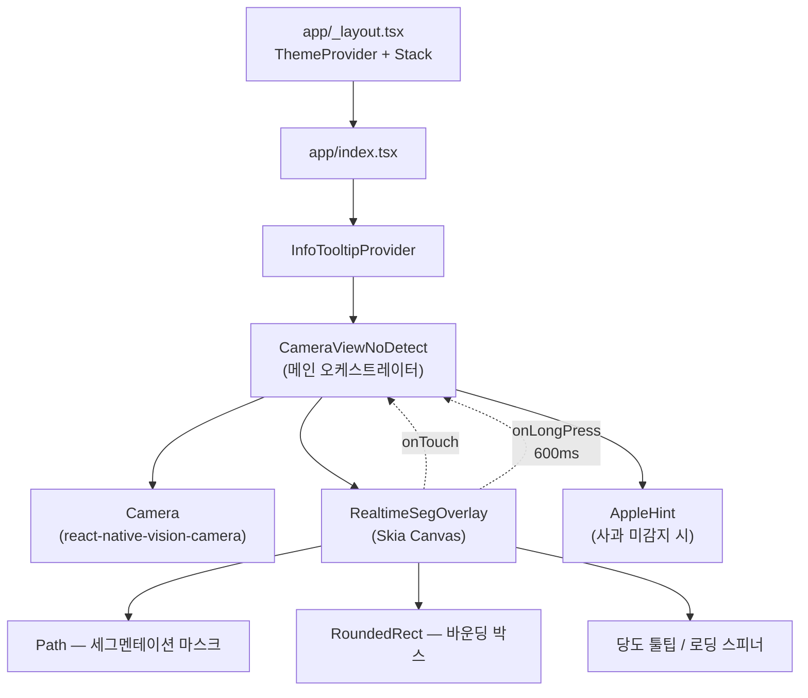
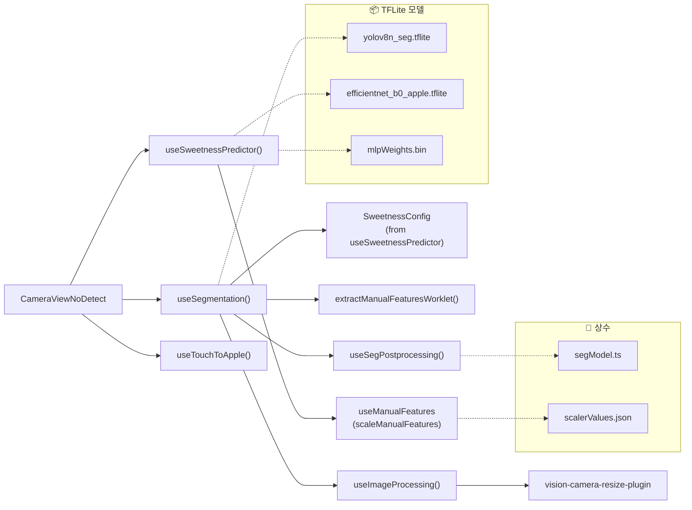
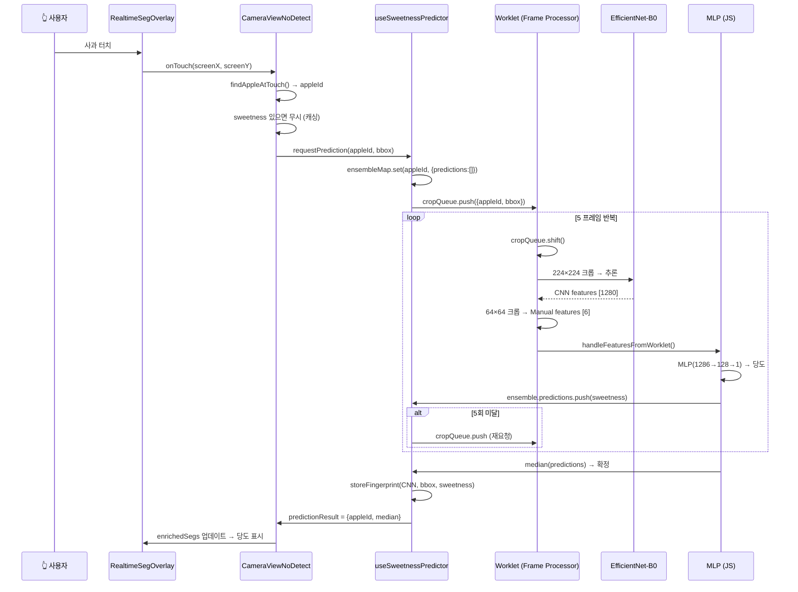
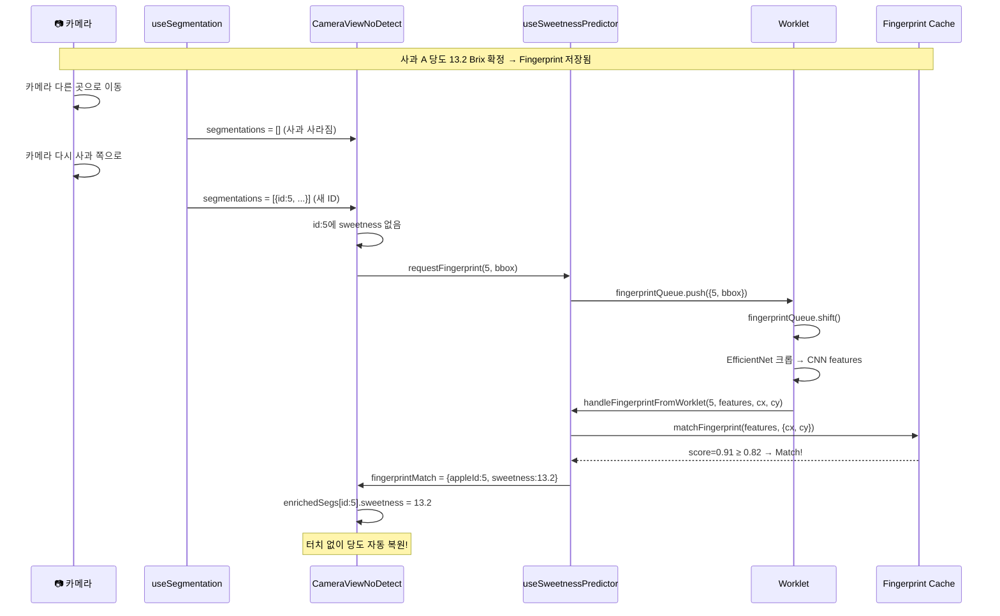
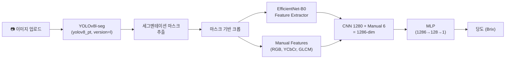

# 달디단 (Daldidan) — 아키텍처 설계 다이어그램

> AI 기반 사과 당도 예측 서비스 | React Native + On-Device ML + FastAPI

---

## 1. 시스템 전체 아키텍처

```mermaid
graph TB
    subgraph Mobile["📱 Mobile App (React Native + Expo)"]
        CAM[카메라 프레임]
        FP["Frame Processor\n(Worklet Thread)"]
        YOLO_D["YOLOv8n-seg\nTFLite (13.8MB)"]
        ENET["EfficientNet-B0\nTFLite (8MB)"]
        MLP["MLP 추론\n(JS Thread)"]
        UI["UI 렌더링\n(Skia Canvas)"]
    end

    subgraph Server["🖥️ Backend Server (AWS EC2)"]
        NGINX[Nginx Reverse Proxy]
        BE["BE Gateway\n(FastAPI)"]
        AI["AI Server\n(FastAPI + GPU)"]
        YOLO_S["YOLOv8l-seg\n(PyTorch)"]
        CNN_S["EfficientNet-B0\n+ MLP (PyTorch)"]
    end

    subgraph Infra["🔧 Infrastructure"]
        JENKINS[Jenkins CI/CD]
        DOCKER[Docker]
        GITLAB[GitLab]
    end

    CAM -->|매 프레임| FP
    FP -->|15프레임당 1회| YOLO_D
    FP -->|크롭 요청 시| ENET
    YOLO_D -->|세그멘테이션 결과| UI
    ENET -->|1280-dim features| MLP
    MLP -->|당도 Brix| UI

    Mobile -.->|REST API /predict\n(Phase 1 Legacy)| NGINX
    NGINX --> BE
    BE --> AI
    AI --> YOLO_S
    AI --> CNN_S

    GITLAB --> JENKINS
    JENKINS --> DOCKER
    DOCKER --> Server
```

---

## 2. 온디바이스 추론 파이프라인 (Phase 3 — 현재)

```mermaid
flowchart LR
    subgraph WorkletThread["🔧 Worklet Thread (매 프레임)"]
        A["📷 카메라 프레임\n(1920×1080)"]
        B["YOLOv8n-seg\n640×640 입력"]
        C["후처리\n(NMS + 마스크)"]
        D["EfficientNet-B0\n224×224 크롭"]
        E["Manual Features\n64×64 크롭"]
    end

    subgraph JSThread["📋 JS Thread"]
        F["Stable ID 할당\n(IoU 매칭)"]
        G["MLP 추론\n(1286→128→1)"]
        H["앙상블 버퍼\n(5프레임 중앙값)"]
        I["Fingerprint\n캐시 매칭"]
        J["UI 상태 업데이트\n(enrichedSegs)"]
    end

    subgraph UIThread["🎨 UI Thread"]
        K["Skia Canvas\n마스크 + bbox"]
        L["당도 툴팁\n표시"]
    end

    A -->|15프레임마다| B
    B --> C
    C -->|SegmentationResult[]| F
    F --> J

    A -->|cropQueue 소비| D
    A -->|cropQueue 소비| E
    D -->|CNN features 1280| G
    E -->|Manual features 6| G
    G --> H
    H -->|5회 완료 → median| J
    H -->|미완료 → 큐에 재요청| D

    A -->|fingerprintQueue 소비| D
    D -->|CNN features| I
    I -->|매칭 성공 → 당도 복원| J

    J --> K
    J --> L
```

---

## 3. FE 컴포넌트 계층 구조



---

## 4. FE 커스텀 훅 의존성



---

## 5. 핵심 데이터 흐름 — 터치 → 당도 예측



---

## 6. Fingerprint 재인식 흐름 (카메라 이동 후 복귀)



---

## 7. 멀티 사과 동시 처리 아키텍처

```mermaid
flowchart TD
    subgraph Queue["cropQueue (SharedValue — JSON 배열)"]
        Q1["{A, bbox_a}"]
        Q2["{B, bbox_b}"]
        Q3["{A, bbox_a}"]
        Q4["{B, bbox_b}"]
    end

    subgraph EnsembleMap["ensembleMapRef (Map)"]
        E_A["Apple A\npredictions: [12.1, 12.3]\n2/5"]
        E_B["Apple B\npredictions: [14.0]\n1/5"]
    end

    subgraph FP["Frame Processor"]
        FRAME["매 프레임: queue.shift()\n→ 1개만 소비"]
    end

    Queue -->|shift()| FRAME
    FRAME -->|CNN features + manual| EnsembleMap
    EnsembleMap -->|5개 완료 → median| RESULT["predictionResult\n{appleId, sweetness}"]
    EnsembleMap -->|미완료 → 큐 재추가| Queue
```

---

## 8. 백엔드 API 아키텍처 (Phase 1 Legacy)

```mermaid
graph LR
    subgraph Client["📱 Mobile"]
        APP[React Native App]
    end

    subgraph Gateway["BE Gateway (FastAPI :8000)"]
        R1["GET /health"]
        R2["POST /dummy_predict"]
    end

    subgraph AIServer["AI Server (FastAPI :8001)"]
        R3["GET /health"]
        R4["POST /predict"]
        DET["detect_service.py\nYOLOv8l-seg (PyTorch)"]
        PRED["predict_service.py\nCNN+MLP Fusion"]
    end

    APP -->|REST API| Gateway
    Gateway --> AIServer
    R4 --> DET
    DET -->|사과 bbox + seg| PRED
    PRED -->|sugar_content (Brix)| R4
```

### AI 서버 추론 파이프라인



---

## 9. 파일 구조 맵

```
📁 SSAFY_3rd_daldidan/
├── 📁 FE/daldidan/                         # React Native (Expo)
│   ├── 📁 app/                              # Expo Router
│   │   ├── _layout.tsx                      #   ThemeProvider + Stack
│   │   └── index.tsx                        #   → CameraViewNoDetect
│   │
│   ├── 📁 components/                       # UI 컴포넌트
│   │   ├── CameraViewNoDetect.tsx           #   메인 오케스트레이터
│   │   ├── RealtimeSegOverlay.tsx           #   Skia 마스크/bbox/터치
│   │   ├── AppleHint.tsx                    #   사과 미감지 힌트
│   │   ├── AnalyzedResultOverlay.tsx        #   API 결과 오버레이 (Legacy)
│   │   ├── DetectionOverlay.tsx             #   감지 글로우 효과
│   │   └── ...                              #   Toast, Button 등 UI
│   │
│   ├── 📁 hooks/                            # 커스텀 훅
│   │   ├── useSweetnessPredictor.ts         #   ★ 당도 예측 파이프라인
│   │   │                                    #     - EfficientNet + MLP
│   │   │                                    #     - 멀티프레임 앙상블
│   │   │                                    #     - Fingerprint 캐시/매칭
│   │   │                                    #     - cropQueue / fingerprintQueue
│   │   ├── useSegmentation.ts               #   ★ YOLOv8n-seg 실시간 추론
│   │   │                                    #     - Frame Processor
│   │   │                                    #     - Stable ID (IoU)
│   │   │                                    #     - 크롭 큐 소비
│   │   ├── useSegPostprocessing.ts          #   YOLOv8 후처리 (NMS, 마스크)
│   │   ├── useManualFeatures.ts             #   수동 특징 6개 (RGB/YCbCr/GLCM)
│   │   ├── useImageProcessing.ts            #   프레임 리사이즈/크롭 유틸
│   │   ├── useTouchToApple.ts               #   터치→사과 매핑 (Ray Casting)
│   │   ├── useObjectDetection.ts            #   EfficientDet (Legacy)
│   │   ├── useAnalysisApiHandler.ts         #   REST API 호출 (Legacy)
│   │   └── useObjectAnalysis.ts             #   API fetch 래퍼 (Legacy)
│   │
│   ├── 📁 constants/                        # 상수 정의
│   │   ├── segModel.ts                      #   YOLOv8n-seg 파라미터
│   │   ├── model.ts                         #   EfficientDet 파라미터
│   │   ├── scalerValues.json                #   StandardScaler 값
│   │   └── api.ts                           #   API 엔드포인트
│   │
│   ├── 📁 assets/                           # 모델 & 리소스
│   │   ├── yolov8n_seg.tflite               #   세그멘테이션 모델 (13.8MB)
│   │   ├── efficientnet_b0_apple.tflite     #   CNN 피처 추출 (8MB)
│   │   ├── mlpWeights.bin                   #   MLP 가중치 (3.7MB)
│   │   └── ...                              #   폰트, 로티, 사운드
│   │
│   └── 📁 hooks/types/
│       └── objectDetection.ts               # 타입 정의
│
├── 📁 BE/
│   ├── 📁 be/                               # Gateway 서버
│   │   ├── main.py                          #   FastAPI 앱
│   │   ├── api/v1/routes.py                 #   /health, /dummy_predict
│   │   ├── schemas/                         #   API/Socket 스키마
│   │   └── Dockerfile                       #   컨테이너화
│   │
│   └── 📁 ai/                               # AI 추론 서버
│       ├── main.py                          #   FastAPI 앱
│       ├── api/v1/routes.py                 #   /health, /predict
│       └── services/
│           ├── predict_service.py           #   당도 추론 디스패처
│           ├── detect_service.py            #   사과 감지 디스패처
│           ├── cnn_feature_maskcrop_seg/    #   ★ CNN+MLP Fusion 모델
│           │   ├── train.py                 #     학습 스크립트
│           │   ├── fusion_model.py          #     모델 정의
│           │   ├── predictor.py             #     추론기
│           │   └── extract_features.py      #     특징 추출
│           └── yolov8/                      #   YOLO 감지 엔진
│               ├── inference/               #     TFLite/PyTorch 백엔드
│               └── models/                  #     모델 가중치
│
└── 📁 scripts/                              # 모델 변환 유틸
    ├── convert_efficientnet_to_tflite.py    #   ONNX → TFLite 변환
    ├── convert_yolov8n_seg.py              #   YOLOv8 → TFLite
    └── extract_mlp_weights.py              #   PyTorch → JSON 가중치
```

---

## 10. 기술 스택 요약

| 계층 | 기술 | 용도 |
|---|---|---|
| **Mobile Framework** | React Native 0.76 + Expo 52 | 크로스 플랫폼 앱 |
| **Camera** | react-native-vision-camera 4.6 | 카메라 접근 + Frame Processor |
| **ML Runtime** | react-native-fast-tflite 1.6 | TFLite 모델 추론 (GPU delegate) |
| **Worklet** | react-native-worklets-core 1.5 | 프레임 프로세서 JS 실행 |
| **Image Processing** | vision-camera-resize-plugin 3.2 | Worklet 내 이미지 리사이즈/크롭 |
| **Rendering** | @shopify/react-native-skia 1.5 | 세그멘테이션 마스크, bbox 렌더링 |
| **Navigation** | expo-router 4.0 | 파일 기반 라우팅 |
| **Backend** | FastAPI (Python) | REST API 서버 |
| **Detection** | YOLOv8n-seg (TFLite, 온디바이스) / YOLOv8l-seg (PyTorch, 서버) | 사과 감지 + 세그멘테이션 |
| **Feature Extraction** | EfficientNet-B0 | CNN 특징 1280차원 추출 |
| **Prediction** | MLP (1286→128→1) | 당도 (Brix) 회귀 |
| **Infra** | AWS EC2 + Docker + Jenkins + Nginx | CI/CD + 배포 |

---

## 11. 진화 단계

| Phase | 방식 | 상태 |
|---|---|---|
| **Phase 1** | 서버 전송 방식: 캡처 → REST API → YOLOv8l + CNN+MLP (서버) → 결과 수신 | Legacy (코드 잔존) |
| **Phase 2** | 온디바이스 감지 + 서버 예측: EfficientDet (온디바이스) → 크롭 → API | Legacy |
| **Phase 3** | **완전 온디바이스**: YOLOv8n-seg + EfficientNet-B0 + MLP 전부 디바이스에서 실행 | **현재 운영** |
| **Phase 3.5** | 멀티프레임 앙상블 (5프레임 중앙값) + Fingerprint 재인식 + 멀티사과 동시 처리 | **현재 구현 완료** |
