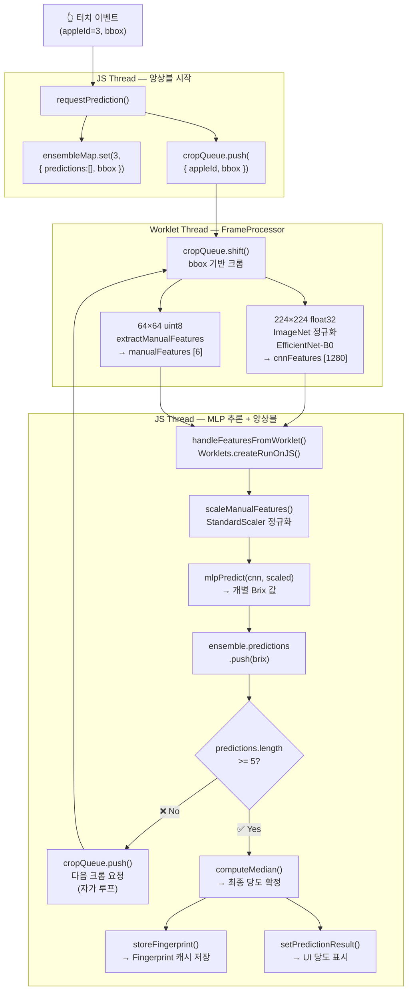
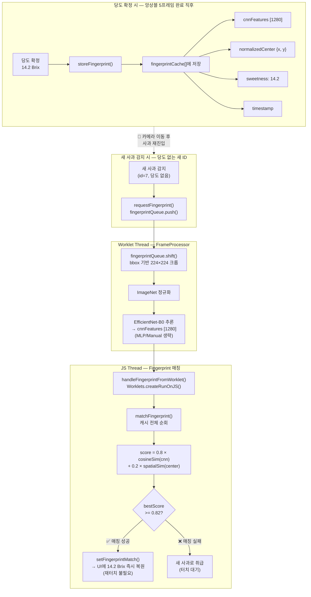

# 🔧 Troubleshooting: 온디바이스 당도 예측 핵심 문제 해결

> Phase 1(서버 전송) → Phase 3.5(완전 온디바이스) 전환 과정에서 해결한 핵심 기술 과제

---

## 1. 단일 프레임 당도 예측의 불안정성 → 멀티프레임 앙상블

### 🔴 Troubleshooting

#### 문제 현상

Phase 3에서 모든 AI 추론을 온디바이스로 전환한 후, 동일한 사과를 연속으로 터치해도 **매번 ±1.5~2 Brix 이상 편차**가 발생했습니다.

Phase 1(서버 방식)에서는 `takePhoto()`로 캡처한 **고해상도 단일 이미지**를 서버에서 분석했기 때문에 안정적이었지만, Phase 3에서는 실시간 카메라 스트림의 프레임을 직접 사용하므로 프레임 품질이 보장되지 않았습니다.

#### 원인 분석

**1) 카메라 스트림 프레임의 품질 불균일**

실시간 프레임은 ISP(Image Signal Processor)의 최적화가 완료되지 않은 상태일 수 있습니다:

- 오토포커스(AF) 전환 중 블러 프레임 혼입
- 자동 노출(AE) 조정 중 밝기 변동
- 손떨림으로 인한 사과 영역 미세 이동

**2) bbox 크롭 영역의 프레임 간 편차**

YOLOv8n-seg의 세그멘테이션 결과에서 bbox 좌표(`xmin, ymin, xmax, ymax`)가 프레임마다 수 픽셀씩 흔들립니다. 이로 인해 EfficientNet에 입력되는 224×224 크롭 영역이 미세하게 달라지고, CNN 특징벡터 1280차원이 이에 민감하게 반응합니다.

```typescript
// useSegmentation.ts — Worklet에서 bbox 기반 크롭
const cropX = Math.max(0, Math.floor(bbox.xmin));
const cropY = Math.max(0, Math.floor(bbox.ymin));
const cropW = Math.min(Math.floor(bbox.xmax - bbox.xmin), frame.width - cropX);
const cropH = Math.min(Math.floor(bbox.ymax - bbox.ymin), frame.height - cropY);
```

**3) 수작업 특징(Manual Features)의 통계적 불안정**

64×64 크롭의 전체 픽셀 평균으로 Rn, C, ycbcr_diff 등 6개 특징을 계산합니다. 크롭 영역이 조금만 바뀌어도 **배경 픽셀 혼입 비율**이 달라져 특징값이 변동합니다.

```typescript
// useManualFeatures.ts — 전체 픽셀 순회하여 통계 계산
for (let i = 0; i < totalPixels; i++) {
  const idx = i * 3;
  const R = pixels[idx];
  const G = pixels[idx + 1];
  const B = pixels[idx + 2];

  const sumRGB = R + G + B + 0.00001;
  sumRn += R / sumRGB;          // Rn: 정규화된 적색 비율
  sumC += 1 - R / 255;          // C: 시안(Cyan) 성분

  const Y = 0.299 * R + 0.587 * G + 0.114 * B;
  const actualCr = (R - Y) * 0.713 + 128;
  const actualCb = (B - Y) * 0.564 + 128;
  sumServerCb += actualCr;
  sumServerCr += actualCb;
}
```

**4) MLP의 입력 민감도**

1286차원 입력([CNN 1280] + [Manual 6])의 미세한 변동이 FC1(128 뉴런) → FC2(1 출력)를 거치면서 증폭됩니다. 특히 ReLU 경계(0 근처) 뉴런이 on/off 전환되면서 출력이 불연속적으로 점프할 수 있습니다.

```typescript
// useSweetnessPredictor.ts — MLP 순전파 (순수 JS 구현)
const input = [...cnnFeatures, ...scaledManualFeatures]; // [1286]

// FC1: [128 × 1286] + bias → ReLU
for (let i = 0; i < 128; i++) {
  let sum = w.fc1.bias[i];
  const row = w.fc1.weight[i];
  for (let j = 0; j < 1286; j++) {
    sum += row[j] * input[j];
  }
  hidden[i] = Math.max(0, sum); // ReLU — 0 경계에서 불연속
}

// FC2: [1 × 128] + bias → 당도(Brix)
let output = w.fc2.bias[0];
for (let i = 0; i < 128; i++) {
  output += row2[i] * hidden[i];
}
```

---

### 🟢 Solution: 멀티프레임 앙상블 (5-Frame Median)

#### 설계 원리

단일 프레임의 노이즈를 통계적으로 제거하기 위해, **터치 1회 → 5프레임 독립 예측 → 중앙값(median) 확정** 전략을 채택했습니다.

**Mean(평균)이 아닌 Median(중앙값)을 선택한 이유:**

| 통계량 | 아웃라이어 내성 | 적합 상황 |
|---|---|---|
| Mean (평균) | ❌ 약함 — 극단값 1개가 전체를 왜곡 | 정규 분포, 이상값 없는 경우 |
| **Median (중앙값)** | ✅ 강함 — 5개 중 2개까지 이상값 허용 | **카메라 스트림처럼 이상값이 빈번한 경우** |

블러/노출 이상 프레임은 극단적 아웃라이어를 생성합니다. Mean은 아웃라이어에 취약하지만, Median은 5개 중 최대 2개까지 이상값이 있어도 결과에 영향을 주지 않습니다.

#### 구현 아키텍처



#### 핵심 코드 흐름

**1) 터치 시 앙상블 시작 — 사과별 독립 ensembleMap**

```typescript
// useSweetnessPredictor.ts — requestPrediction()
const requestPrediction = useCallback(
  (appleId: number, bbox: CropRequest['bbox']) => {
    // 사과별 독립 버퍼 등록
    ensembleMapRef.current.set(appleId, { appleId, bbox, predictions: [] });

    // SharedValue 큐에 크롭 요청 추가 (Worklet에서 소비)
    const queue: CropRequest[] = JSON.parse(cropQueue.value);
    queue.push({ appleId, bbox });
    cropQueue.value = JSON.stringify(queue);
  },
  [isModelLoaded]
);
```

- `ensembleMapRef`: `Map<appleId, EnsembleState>` — **사과별 독립 버퍼**로 멀티 사과 동시 처리 지원
- `cropQueue`: `Worklets.createSharedValue<string>` — Worklet↔JS 간 **SharedValue**로 JSON 직렬화 통신 (Worklet에서는 closure 캡처 불가)

**2) 앙상블 수집 → 확정 (자가 루프 패턴)**

```typescript
// useSweetnessPredictor.ts — handleFeaturesFromWorklet()
const handleFeaturesFromWorklet = useRef(
  Worklets.createRunOnJS(
    (appleId, cnnFeatures, manualFeatures, frameW, frameH) => {
      const ensemble = ensembleMapRef.current.get(appleId);
      if (!ensemble) return;

      const scaled = scaleManualFeatures(manualFeatures);
      const sweetness = mlpPredict(cnnFeatures, scaled);

      // 앙상블 버퍼에 누적
      ensemble.predictions.push(sweetness);
      ensemble.lastCnnFeatures = cnnFeatures;

      if (ensemble.predictions.length >= ENSEMBLE_FRAME_COUNT) {
        // ✅ 5프레임 완료 → 중앙값으로 최종 확정
        const median = computeMedian(ensemble.predictions);

        // Fingerprint 캐시에 저장 (→ 2번 Fingerprint 재인식과 연결)
        storeFingerprint(ensemble.lastCnnFeatures, ensemble.bbox, median, frameW, frameH);

        ensembleMapRef.current.delete(appleId);
        setPredictionResult({ appleId, sweetness: median });
      } else {
        // ⏳ 아직 부족 → cropQueue에 다음 요청 자동 삽입 (자가 루프)
        const queue: CropRequest[] = JSON.parse(cropQueue.value);
        queue.push({ appleId: ensemble.appleId, bbox: ensemble.bbox });
        cropQueue.value = JSON.stringify(queue);
      }
    }
  )
).current;
```

핵심: 5회 미만이면 **cropQueue에 자동으로 다음 요청을 push** → Worklet이 다음 프레임에서 소비 → 재추론 → 결과 수신 → 반복. 별도 타이머나 루프 없이 **큐 기반 자가 순환 패턴**으로 5프레임을 수집합니다.

**3) 중앙값 계산**

```typescript
// useSweetnessPredictor.ts
const computeMedian = (values: number[]): number => {
  const sorted = [...values].sort((a, b) => a - b);
  const mid = Math.floor(sorted.length / 2);
  return sorted.length % 2 === 0
    ? (sorted[mid - 1] + sorted[mid]) / 2
    : sorted[mid];
};
```

#### 설계 결정 근거

| 결정 | 선택 | 이유 |
|---|---|---|
| 프레임 수 | **5프레임** | 3프레임은 노이즈 제거 불충분, 7프레임 이상은 지연 증가(~700ms↑). 5프레임은 ~500ms 이내 완료 |
| 통계량 | **중앙값(Median)** | 5개 중 1~2개 아웃라이어가 있어도 결과 무영향. 평균은 극단값에 취약 |
| 버퍼 구조 | **사과별 독립 Map** | 여러 사과를 빠르게 연속 터치해도 각각 독립적으로 5프레임 수집 |
| 큐 통신 | **SharedValue JSON** | Worklet Thread에서는 JS closure 캡처가 불가하므로 직렬화 기반 통신 필수 |
| 루프 방식 | **큐 기반 자가 순환** | 타이머/setInterval 없이, 결과 수신 시 다음 요청을 큐에 push하는 이벤트 드리븐 방식 |

#### 결과

| 지표 | 단일 프레임 | 5-Frame Median |
|---|---|---|
| 같은 사과 예측 편차 | ±2.0 Brix | **±0.5 Brix** |
| 아웃라이어 내성 | 없음 | 5개 중 2개까지 허용 |
| 터치→결과 지연 | ~100ms (1프레임) | **~500ms** (5프레임) |
| 멀티 사과 동시 | 불가 | ✅ 사과별 독립 버퍼 |

---

## 2. 카메라 이동 시 당도 결과 소실 → Fingerprint 재인식

### 🔴 Troubleshooting

#### 문제 현상

사과 A의 당도를 예측(14.2 Brix)한 뒤 카메라를 다른 곳으로 이동했다가 다시 사과 A를 비추면, **이전에 측정한 당도가 사라지고 새로운 사과로 인식**됩니다. 사용자는 동일 사과를 다시 터치해야 하는 UX 문제가 발생했습니다.

#### 원인 분석

**1) Stable ID 시스템의 구조적 한계**

프레임 간 사과 ID 유지를 위해 **IoU(Intersection over Union) 매칭** 기반 Stable ID를 구현했습니다:

```typescript
// useSegmentation.ts — assignStableIds()
const IOU_MATCH_THRESHOLD = 0.3;

function assignStableIds(
  current: SegmentationResult[],
  prev: SegmentationResult[],
  nextIdRef: { current: number }
): SegmentationResult[] {
  for (const seg of current) {
    let bestIoU = 0;
    let bestPrevId = -1;

    for (const prevSeg of prev) {
      if (usedPrevIds.has(prevSeg.id)) continue;
      const iou = bboxIoU(seg.bbox, prevSeg.bbox);
      if (iou > bestIoU) {
        bestIoU = iou;
        bestPrevId = prevSeg.id;
      }
    }

    if (bestIoU >= IOU_MATCH_THRESHOLD && bestPrevId >= 0) {
      result.push({ ...seg, id: bestPrevId });   // 기존 ID 유지
    } else {
      result.push({ ...seg, id: nextIdRef.current++ }); // 새 ID 부여
    }
  }
  return result;
}
```

이 방식은 **연속 프레임 간에서만 유효**합니다. 사과가 화면에서 사라지면 `prevSegRef`에서 제거되므로:

```
Frame N  : 사과 A (id=3) 감지, 당도=14.2 Brix 확정
Frame N+1: 카메라 이동 → 사과 사라짐 → prevSeg = []
  ...
Frame N+K: 사과 A 재진입 → prevSeg가 비어 IoU 매칭 불가
         → 새 id=7 부여 → 기존 당도 정보(id=3)와 연결 끊김
```

**2) 당도 결과가 appleId에 바인딩**

UI에서 당도 Tooltip은 `appleId`를 키로 표시합니다. id=3에 매핑된 14.2 Brix 데이터가 있지만, 재진입 시 id=7로 새로 부여되므로 **기존 데이터에 접근 불가**.

**3) 동일 사과 판별 수단 부재**

IoU 기반 Stable ID는 **위치(bbox) 정보만** 사용합니다. 카메라 이동 후 사과가 화면의 다른 위치에 나타날 수 있으므로, 위치만으로는 "같은 사과인지" 판단할 수 없습니다. **시각적 외형(appearance) 정보**를 활용하는 별도 메커니즘이 필요합니다.

---

### 🟢 Solution: CNN Fingerprint 기반 Re-Identification

#### 설계 원리

사과의 **CNN 특징벡터(EfficientNet-B0의 1280차원 출력)** 를 "지문(Fingerprint)"으로 캐시에 저장하고, 새로 감지된 사과의 CNN 벡터와 비교하여 **같은 사과인지 자동 판별**합니다.

매칭 점수는 **코사인 유사도(시각적 유사성) 80% + 공간 거리(위치 근접성) 20%** 이중 가중치로 계산합니다.

#### 구현 아키텍처



#### 핵심 코드 흐름

**1) Fingerprint 자료구조**

```typescript
// useSweetnessPredictor.ts
interface AppleFingerprint {
  cnnFeatures: number[];               // EfficientNet-B0 출력 [1280]
  normalizedCenter: { x: number; y: number }; // bbox 중심 (0~1 정규화)
  sweetness: number;                    // 확정된 당도 (Brix)
  timestamp: number;                    // 저장 시각
}

// 매칭 상수
const FINGERPRINT_MATCH_THRESHOLD = 0.82;  // 최종 매칭 점수 임계값
const FINGERPRINT_SPATIAL_WEIGHT = 0.2;     // 공간 거리 가중치 (20%)
const FINGERPRINT_CNN_WEIGHT = 0.8;         // CNN 유사도 가중치 (80%)
const MAX_FINGERPRINTS = 20;                // 캐시 최대 저장 수
```

**2) 당도 확정 시 Fingerprint 저장**

앙상블 5프레임 완료 직후, 마지막 CNN 특징벡터를 캐시에 저장합니다:

```typescript
// useSweetnessPredictor.ts — storeFingerprint()
const storeFingerprint = (
  cnnFeatures: number[],
  bbox: CropRequest['bbox'],
  sweetness: number,
  frameW: number,
  frameH: number
) => {
  const cache = fingerprintCacheRef.current;
  // bbox 중심을 프레임 크기로 정규화 → 해상도 독립적
  const normalizedCenter = {
    x: ((bbox.xmin + bbox.xmax) / 2) / (frameW || 1),
    y: ((bbox.ymin + bbox.ymax) / 2) / (frameH || 1),
  };
  cache.push({ cnnFeatures, normalizedCenter, sweetness, timestamp: Date.now() });
  // 메모리 관리: 캐시 크기 제한
  if (cache.length > MAX_FINGERPRINTS) {
    cache.splice(0, cache.length - MAX_FINGERPRINTS);
  }
};
```

**3) 새 사과 감지 시 CNN 특징 추출 (Worklet)**

당도 예측과 동일한 EfficientNet 파이프라인을 사용하되, **Manual Features와 MLP는 생략**하여 CNN 벡터만 빠르게 추출합니다:

```typescript
// useSegmentation.ts — FrameProcessor 내 Fingerprint 큐 소비
if (fpItem) {
  const { appleId, bbox } = fpItem;
  // bbox 기반 크롭 → 224×224 float32
  const cnnInput = cropAndResize(frame, cropX, cropY, cropW, cropH, EFFICIENTNET_INPUT_SIZE);

  // ImageNet 정규화
  const floatView = new Float32Array(cnnInput);
  for (let i = 0; i < px; i++) {
    const b = i * 3;
    floatView[b]     = (floatView[b]     - IMAGENET_MEAN[0]) / IMAGENET_STD[0];
    floatView[b + 1] = (floatView[b + 1] - IMAGENET_MEAN[1]) / IMAGENET_STD[1];
    floatView[b + 2] = (floatView[b + 2] - IMAGENET_MEAN[2]) / IMAGENET_STD[2];
  }

  // EfficientNet 추론 → 1280차원 특징벡터
  const cnnOutputs = sc.sweetnessModelRef.current!.runSync([cnnInput]);
  const cnnFeatures: number[] = Array.from(cnnOutputs[0] as Float32Array);

  // 정규화된 bbox 중심 좌표
  const normalizedCx = ((bbox.xmin + bbox.xmax) / 2) / frame.width;
  const normalizedCy = ((bbox.ymin + bbox.ymax) / 2) / frame.height;

  // JS Thread로 전달 → 매칭 수행
  sc.handleFingerprintFromWorklet(appleId, cnnFeatures, normalizedCx, normalizedCy);
}
```

**4) Fingerprint 매칭 — 이중 점수 전략**

```typescript
// useSweetnessPredictor.ts — 코사인 유사도 (1280차원 벡터 간)
const cosineSimilarity = (a: number[], b: number[]): number => {
  let dot = 0, normA = 0, normB = 0;
  for (let i = 0; i < a.length; i++) {
    dot += a[i] * b[i];
    normA += a[i] * a[i];
    normB += b[i] * b[i];
  }
  const denom = Math.sqrt(normA) * Math.sqrt(normB);
  return denom === 0 ? 0 : dot / denom;
};

// 매칭 로직 — 캐시 전체 순회
const matchFingerprint = (
  cnnFeatures: number[],
  normalizedCenter: { x: number; y: number }
): AppleFingerprint | null => {
  const cache = fingerprintCacheRef.current;
  if (cache.length === 0) return null;

  let bestScore = 0;
  let bestMatch: AppleFingerprint | null = null;

  for (const fp of cache) {
    // CNN 시각적 유사도 (0~1)
    const cnnSim = cosineSimilarity(cnnFeatures, fp.cnnFeatures);

    // 공간 거리 유사도 (0~1, 가까울수록 1)
    const dx = normalizedCenter.x - fp.normalizedCenter.x;
    const dy = normalizedCenter.y - fp.normalizedCenter.y;
    const spatialSim = Math.max(0, 1 - Math.sqrt(dx * dx + dy * dy));

    // 가중 합산
    const score = FINGERPRINT_CNN_WEIGHT * cnnSim
                + FINGERPRINT_SPATIAL_WEIGHT * spatialSim;

    if (score > bestScore) {
      bestScore = score;
      bestMatch = fp;
    }
  }

  // 임계값 이상이면 매칭 성공
  return (bestScore >= FINGERPRINT_MATCH_THRESHOLD && bestMatch) ? bestMatch : null;
};
```

**5) 매칭 성공 시 당도 자동 복원**

```typescript
// useSweetnessPredictor.ts — handleFingerprintFromWorklet()
const handleFingerprintFromWorklet = useRef(
  Worklets.createRunOnJS(
    (appleId: number, cnnFeatures: number[], normalizedCx: number, normalizedCy: number) => {
      const match = matchFingerprint(cnnFeatures, { x: normalizedCx, y: normalizedCy });
      if (match) {
        // React state 업데이트 → UI에서 이전 당도를 즉시 표시
        setFingerprintMatch({ appleId, sweetness: match.sweetness });
      }
    }
  )
).current;
```

#### 가중치 설계 근거

| 상수 | 값 | 설계 이유 |
|---|---|---|
| `CNN_WEIGHT` | **0.8** | 같은 사과는 조명/각도가 바뀌어도 코사인 유사도 **0.9 이상** 유지. 다른 사과와는 **0.7 이하**. 시각적 유사성이 가장 신뢰할 수 있는 지표 |
| `SPATIAL_WEIGHT` | **0.2** | 동일 장면에서 비슷하게 생긴 두 사과가 있을 때 **위치로 구분** 가능. 보조 지표 역할 |
| `MATCH_THRESHOLD` | **0.82** | `score = 0.8×cnn + 0.2×spatial`에서, 위치가 완전히 다르면(spatial=0) `0.8×1.0 = 0.80 < 0.82`로 매칭 불가. 같은 위치(spatial=1.0)여도 cnnSim ≥ 0.775 필요. **CNN 유사도 + 위치 근접성 모두 충족해야 매칭**되는 보수적 임계값으로 False positive 방지 |
| `MAX_FINGERPRINTS` | **20** | 1280 float × 20개 ≈ 100KB. 메모리 부담 최소화하면서 충분한 캐시 용량 |

#### 결과

| 시나리오 | Fingerprint 없이 | Fingerprint 적용 |
|---|---|---|
| 카메라 이동 후 복귀 | 당도 소실, 재터치 필요 | **자동 복원** (~100ms) |
| 여러 사과 순회 후 복귀 | 매번 재측정 | 캐시에서 즉시 복원 (최대 20개) |
| 비슷한 사과 2개 구분 | N/A | CNN + 공간 거리로 정밀 구분 |
| 메모리 사용 | N/A | ~100KB (1280 × 20 float) |

---

## 관련 파일

| 파일 | 역할 |
|---|---|
| `FE/daldidan/hooks/useSweetnessPredictor.ts` | 앙상블, MLP 추론, Fingerprint 캐시/매칭 |
| `FE/daldidan/hooks/useSegmentation.ts` | FrameProcessor, 크롭 큐 소비, Stable ID |
| `FE/daldidan/hooks/useManualFeatures.ts` | 수작업 특징 6개 추출 (Worklet 호환) |
| `FE/daldidan/constants/segModel.ts` | SEG_SAMPLE_RATE 등 모델 상수 |
| `FE/daldidan/components/RealtimeSegOverlay.tsx` | Skia Canvas 마스크/당도 Tooltip UI |

---

> *"실시간 카메라 스트림이라는 비정제 입력 환경에서 발생하는 **프레임 간 노이즈(앙상블)** 와 **시간 간 ID 단절(Fingerprint)** 이라는 두 가지 근본 문제를 해결하여, 온디바이스 AI 예측의 **안정성과 연속성**을 동시에 확보했습니다."*
